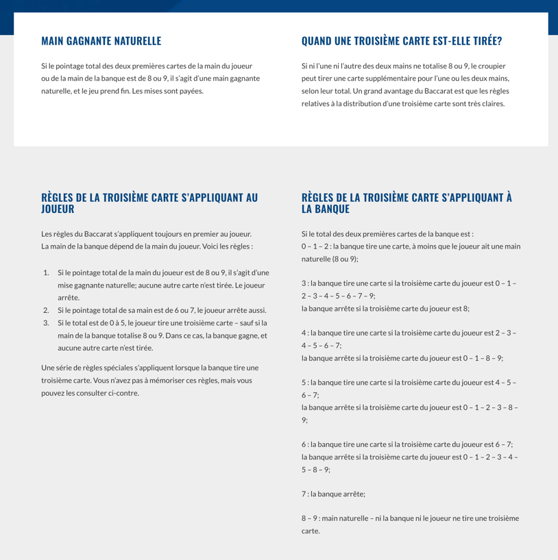

# Tests de caractérisation - Solution

Les plus "gamblers" parmi vous auront peut-être reconnu les règles dictant la distribution d'une troisième
carte à la main du banquier dans le jeu du [baccarat](https://www.playsmart.ca/table-games/baccarat/how-to-play/?lang=fr).

Vous remarquerez probablement l'utilisation des tests paramétrisés et d'une approche exhaustive et aléatoire dans l'écriture
des tests de caractérisation.

Bien qu'il s'agisse de mauvaises pratiques d'écriture de tests unitaires traditionnels, dans le cas présent, cette approche
est intéressante pour différentes raisons :

- Nous cherchons principalement à construire notre compréhension du composant.
- Par simple analyse combinatoire, il existe environ 110000 combinaisons possibles de mains en ne considérant que la valeur des cartes
  - Chaque carte peut avoir une valeur de 0-9 (10 valeurs).
  - La main du joueur peut avoir 2 ou 3 cartes.
    - 10 x 10 = 100 combinaisons
    - 10 x 10 x 10 = 1000 combinaisons
    - 100 + 1000 = 1100 combinaisons
  - La main du banquier doit avoir 2 cartes (100 combinaisons).
  - En considérant le cas d'exception où la main du banquier peut déjà avoir trois cartes lorsqu'elle est passée en argument, le nombre de combinaisons explose à 1100000 combinaisons.
  - Il s'agit de beaucoup trop de cas de tests différents pour avoir une suite de tests qui s'exécute suffisamment rapidement.
- Chaque exécution produire des nouvelles valeurs, si nos tests sont erronés, ils finiront par briser à un moment où un autre.
- La taille de l'échantillonnage est facilement configurable, ce qui nous permet de rendre nos tests plus exhaustifs sur demande.
- Une fois les tests de caractérisation complétés, ces derniers pourront être supprimés.
  - Une nouvelle suite de tests unitaires exprimant les connaissances acquises devrait normalement être produite dans le cadre du réusinage.
  - Ceux-ci peuvent aussi être conservés, mais ils seront probablement pas exécutés automatiquement à même les autres tests de l'application.

Il est aussi important de noter qu'il n'existe pas de solution exacte ou idéale à ce genre de tests qui sont de nature plus exploratoire.
Contrairement à des tests unitaires traditionnels, ces tests seront plutôt le fruit d'une suite d'essais et erreurs.
L'important est qu'au cours de l'exercice, vous ayez été en mesure d'établir les différentes règles suivantes :

- La valeur de chaque carte peut prendre une valeur de 0 à 9.
- Une main peut avoir 2 ou 3 cartes.
- Le score d'une main correspond à l'addition de la valeur des cartes de la main modulo 10.
- Si la main du banquier possède déjà trois cartes, il ne peut pas tirer une autre carte.
- Si l'une des deux mains présente une victoire naturelle (score de 8 ou 9 avec les deux premières cartes), aucune carte n'est tirée.
- Si le joueur n'a que deux cartes, le banquier tire une carte si son score est plus petit ou égal à 5.
- Si la main initiale du banquier vaut 0, 1 ou 2 points, celui-ci tire une troisième carte quelle que soit la troisième carte du joueur.
- Si la main initiale du banquier vaut 3 points, celui-ci tire une carte sauf si la troisième carte du joueur est un 8.
- Si la main initiale du banquier vaut 4 points, celui-ci tire une carte si la troisième carte du joueur est 2, 3, 4, 5, 6 ou 7.
  - Par contre, si la troisième carte du joueur vaut 0, 1, 8 ou 9, aucune carte n’est tirée.
- Si la main initiale du banquier vaut 5 points, celui-ci tire une carte à condition que la troisième carte du joueur soit 4, 5, 6 ou 7.
  - Si la troisième carte du joueur vaut plutôt 0, 1, 2, 3, 8 ou 9, aucune carte n’est tirée.
- Si la valeur initiale de la main du banquier est de 6 points, une carte est tirée uniquement si la troisième carte du joueur est un 6 ou un 7.
- Si la valeur de la main du banquier vaut 7 points, il ne tire pas de carte quelle que soit la troisième carte du joueur.

Bien que vous n'ayez pas été en mesure d'identifier le jeu du baccarat, si vos règles sont exprimées en fonction des noms de variables douteux fournis,
considérez l'exercice comme une réussite. Dans un contexte réel, vous aurez normalement plus d'information sur le contexte de l'application et vous
aurez aussi une idée globale du rôle du composant sans en connaître l'ensemble de ses fonctionnalités/particularités.
